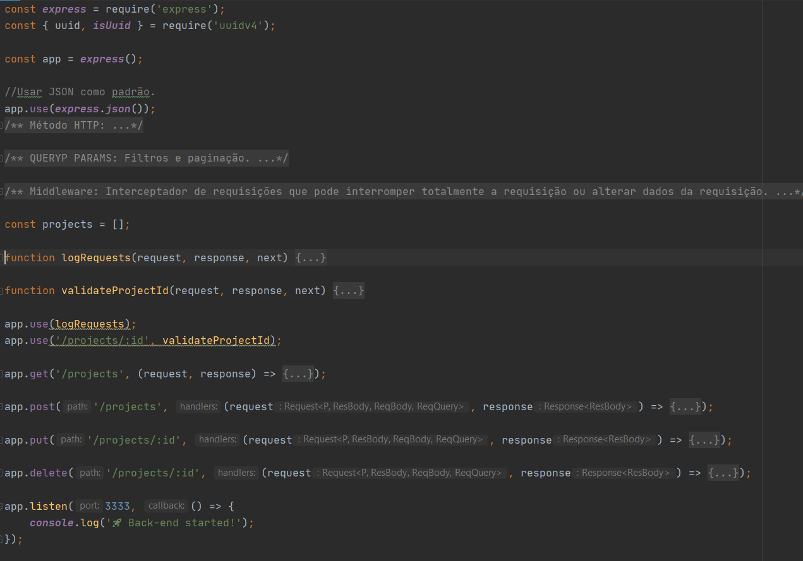

  <a href="#rocket-tecnologias">Tecnologias</a>&nbsp;&nbsp;&nbsp;|&nbsp;&nbsp;&nbsp;
  <a href="#-projeto">Projeto</a>&nbsp;&nbsp;&nbsp;|&nbsp;&nbsp;&nbsp;
  <a href="#-como-rodar">Como rodar</a>&nbsp;&nbsp;&nbsp;|&nbsp;&nbsp;&nbsp;
  <a href="#-como-contribuir">Como contribuir</a>&nbsp;&nbsp;&nbsp;
  

 

  

## GoStack - Back-end com Node.js

## 🚀 Tecnologias

Esse projeto foi desenvolvido com as seguintes tecnologias:

- [Node.js](https://nodejs.org/en/) - v14.4.0
- [Yarn](https://yarnpkg.com/) - 1.22.4
- [Npm](https://www.npmjs.com/) - 6.14.5

## 💻 Projeto

Uma API simples e sem banco de dados onde é possível executar a rota de listagem(com filtro), cadastro, alteração e exclusão.

Projeto rodando na porta 3333 e recebe e retorna JSON.

## 👩🏿‍💻 Rotas

- **`POST /projects`**: A rota deve receber title, e owner dentro do corpo da requisição. 
Formato { title: 'Desafio Node.js', owner: 'João Mangueira' }. É possível usar um filtro para title passando o parâmetro "?title=Reacet".

- **`GET /projects`**: Rota que lista todos os projetos;

- **`PUT /projects/:id`**: Rota que altera um projeto usando o ID;

- **`DELETE /projects/:id`**: Rota que exclui um projeto usando o ID;

## 🚀 Como Rodar

- Clone o projeto.
- Entre na pasta do projeto e rode yarn install (pode usar npm install de acordo com a sua configuração).
- yarn dev.

## 🤔 Como contribuir

- Faça um fork desse repositório;
- Cria uma branch com a sua feature: `git checkout -b minha-feature`;
- Faça commit das suas alterações: `git commit -m 'feat: Minha nova feature'`;
- Faça push para a sua branch: `git push origin minha-feature`.

Depois que o merge da sua pull request for feito, você pode deletar a sua branch.

## 📝 Licença

Esse projeto está sob a licença MIT.
